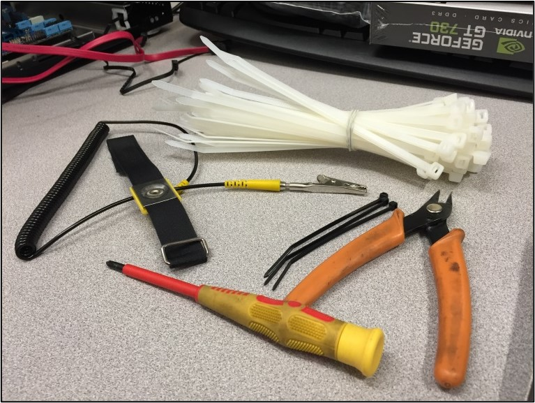
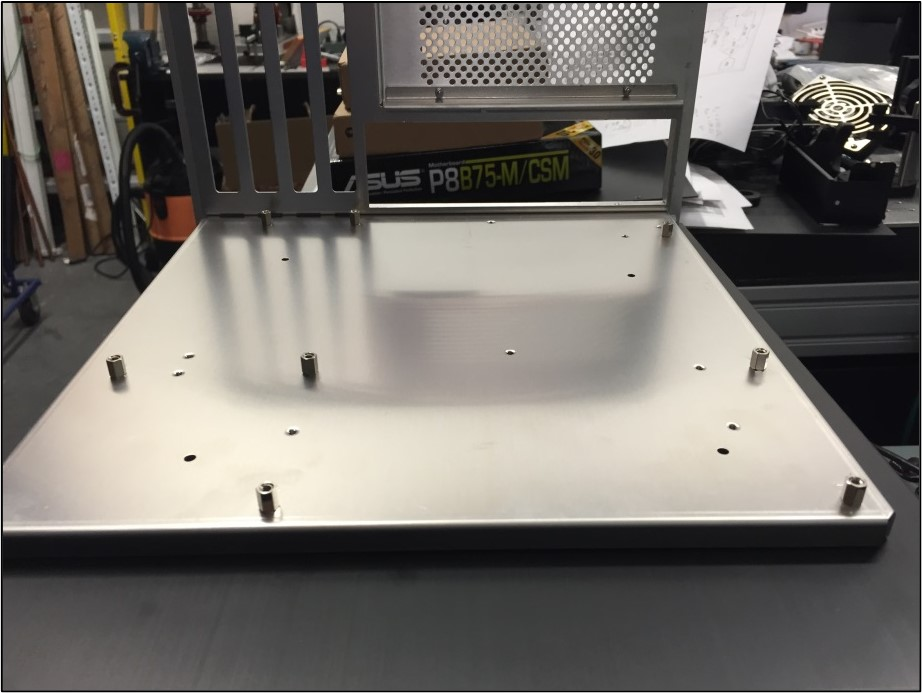

# Five Reasons to Build your Own Computer

The retail market is full of computers for every level of consumer, from casual home users to professionals and enthusiasts. So, why would you put in the extra effort, and perhaps the extra cost, to build a computer from scratch? 

1.	*Choosing your own components*  
Retail computers come pre-packaged with components, and you have no control over the quality or age of those components. A reasonably powerful retail computer may have the latest CPU and a lot of RAM, for example, but the graphics card may be a generation old. For a high-end retail computer, expect to pay well over $3,000.00 for a custom computer with all of the best and latest components. A reasonably powerful retail computer can be acquired for around $1,000.00, but again, you may be paying for older components of lesser quality.  
By choosing your own components, you have control over your computer’s specifications, the quality of its components, and some control over its price.

2.	*No Bloatware*  
Bloatware is software you may never need that takes up valuable space on your hard drive, and it is included in nearly every retail computer on the market. Bloatware is pre-installed software that usually includes toolbars, additional disk burners, media players, and subscription-based anti-virus software. 
When you build your own computer, you install a clean operating system with no proprietary software, no browser toolbars, and no anti-virus software. You have control over everything installed on your computer. If you are concerned about security, Windows 8 and 10 install with free anti-virus software from Microsoft.

3.	*Operating System*  
Most retail computers come with Windows pre-installed (or OS X for Mac users). By building your own computer, you can choose any operating system available including open source operating systems such as Linux.

4.	*Warranty*  
The manufacturer’s warranty on most retail computers is one year. Some custom configurations will offer an extended warranty for an additional cost. By comparison, individual components purchased separately for a custom build come with a three to five year warranty. 

5.	*Footprint*  
By building your own computer, you have control over the size and the look of your computer. There are a few motherboard form factors available for multiple case sizes. A reasonably powerful computer can be made on a mini-ITX motherboard, a case for which typically has a footprint of about 10 x 14 inches (W x D), but can be as small as 5 x 7 inches (W x D). Micro-ATX is a popular form factor because it has a smaller footprint than the full size ATX motherboard, and it has four PCI card slots for graphics cards and other peripherals whereas a mini-ITX typically has only one PCI card slot. A full ATX motherboard will typically have six PCI card slots, and is the largest and most common form factor.

# Installing your Motherboard

Installing your motherboard is the first step in building your own computer. Make sure you have gathered all of the tools and supplies you will need, including:
-	#2 size Philips screwdriver
-	zip ties
-	flush cutters 
> :bulb: **Tip:** Using an anti-static wrist strap or an anti-static mat is recommended.

 
  
1.	Place your case on a flat work surface and remove the panels to access the motherboard mount. Remove the motherboard mount from the case, if it is removable. 
2.	Insert the standoff screws. The standoff screws will be included with your case.
> :memo: **Note:** Consult your motherboard’s documentation for the correct screw hole pattern.
  
 
 
3.	Install the motherboard I/O shield. It will snap into place from inside the case.
  
  
 
4.	Align the motherboard with the I/O shield and standoff screws. 

> :warning: **Warning:** Be sure that the metal tabs on the inside of the I/O shield do not slide into the connectors! Make sure they slide on top of the connectors instead.  
 

5.	Gently press the motherboard into the I/O shield to align the motherboard’s screw holes with the standoffs you installed in **Step 2**.

6.	Secure the motherboard using the screws provided with your case. 
> :warning: **Caution:** Do not over tighten the screws.
 
Once you have secured the motherboard to the case, you are ready to install the CPU. 

