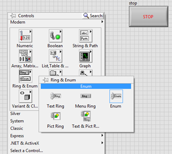
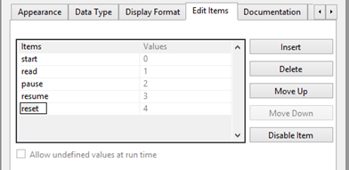
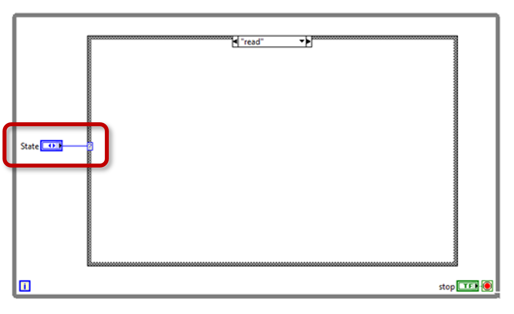
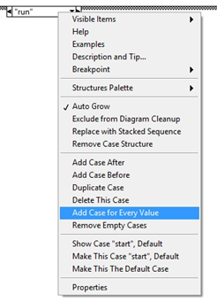
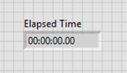
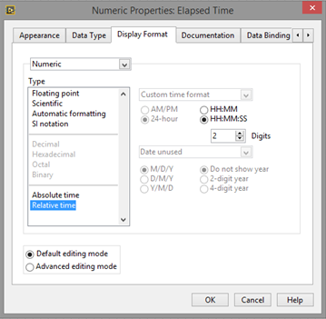
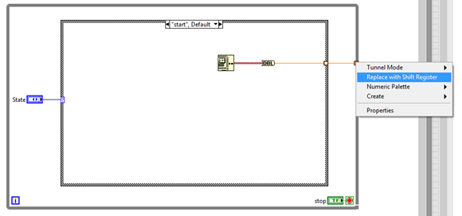
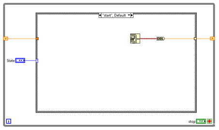

# How to Build a Timer in LabVIEW

*The goal of this document is to help the reader create a simple timer with pause and resume function. This document assumes basic knowledge of LabVIEW.*

## Basic Structure and Front Panel Controls
1.	Open LabVIEW and create a new VI by pressing **CTRL + N**.
2.	Show the Block Diagram by pressing **CTRL + E**.
3.	Place a while loop on the block diagram.
4.	Wire a **Stop** button to the while loop’s stop condition.
5.	Place a case structure inside the while loop. Case Structure is found on the Structures palette along with the while loop. The case structure will contain the code associated with each command.
6.	Show the Front Panel by pressing **CTRL + E**.
7.	Place an enum control on the front panel. 
 
8.	Highlight the label on the enum control and rename it *State*.
9.	Right-click the enum control and select **Edit Items**. This will open the Enum Properties window.
 
10.	Enter the items as shown above, then click **OK**.
11.	Double-click the enum control to find it on the block diagram.
12.	Move the enum control on the block diagram to the left of the case structure you placed earlier.
13.	Wire the enum control to the selector terminal of the case structure.
 

14.	Right-click on the case selector label (at the top of the case structure) and select Add case for every value. This loads all available cases from the enum.
  

15.	Press **CTRL + E** again to show the front panel.
16.	Right-click on the front panel and hover over **Numeric** to show the Numeric palette.
17.	Select **Numeric Control** and place it on the front panel.
18.	Highlight the label and rename it *Elapsed Time*.  

[line break (above) is two spaces after line.]: #
19.	Change the display of the numeric control to show time format.
a.	Right-click the numeric control.
b.	Select Display Format.
c.	Under Type select Relative Time.
d.	Select HH:MM:SS with 2 digits of precision.
e.	Click OK.
 

 
## Start and Read Timer
Now that we have our structure, we can build a basic timer. You will be able to start and stop the timer at the end of this section.

1.	Select the **Start** case in the case structure.
2.	Right-click the Block Diagram and select **Get Date and Time in Seconds** from the Timing palette.
3.	Wire Get Date and Time in Seconds to the right side of the while loop.
4.	Right-click the tunnel (small box) on the while loop and select **Replace with Shift Register**. The shift register will store the date/time value for the next iteration of the loop.

5.	An identical shift register will appear on the left side of the loop. Wire this to the edge of the case structure.  
 

6.	To convert the date/time (brown wire) to double precision (orange wire), right-click on the wire inside the case structure and select **Insert  >>  Numeric >> Conversion >> To Double Precision**.
7.	

